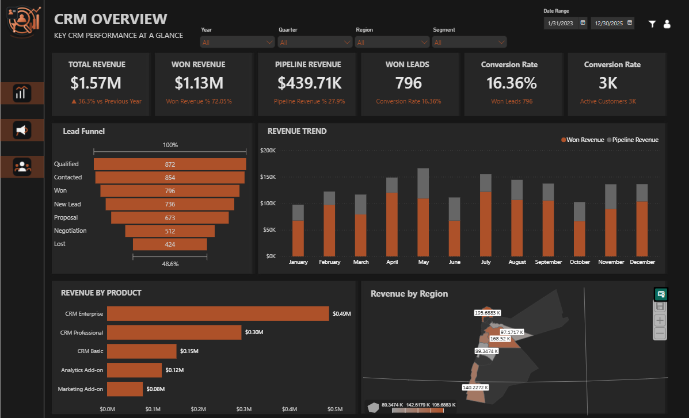
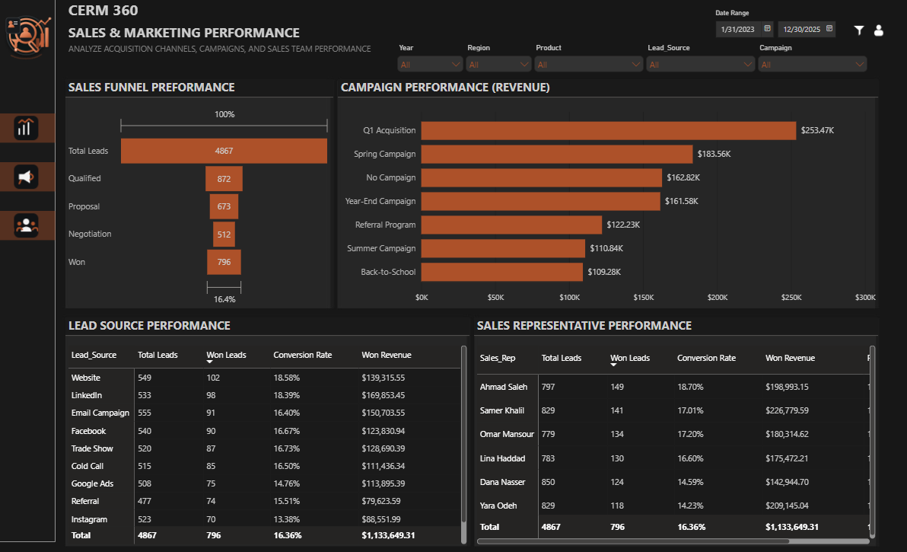
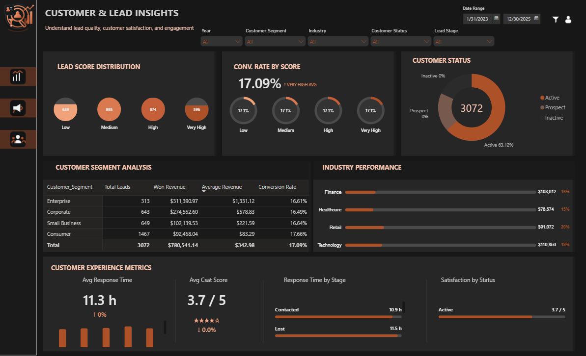
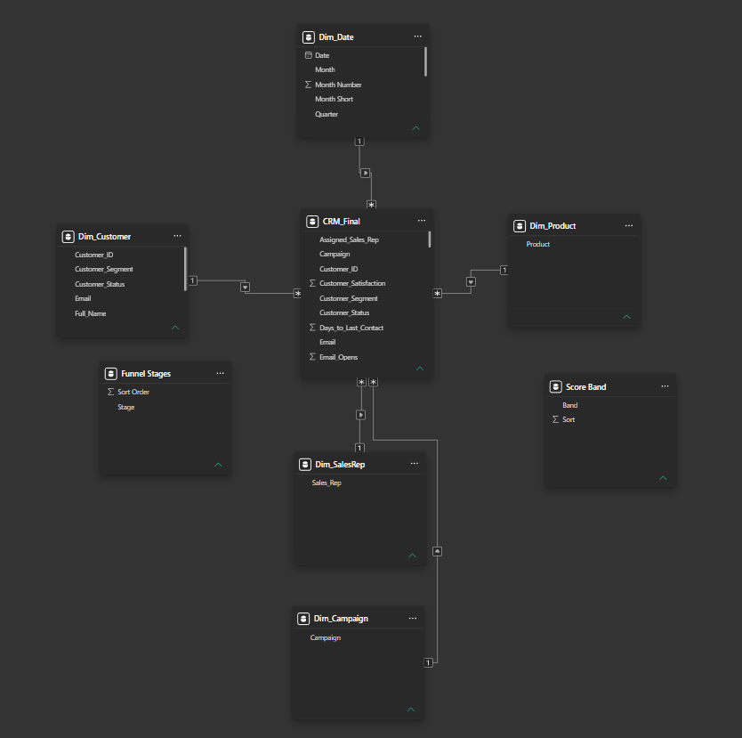

# CRM 360 — Sales & Customer Analytics Dashboard

An end-to-end CRM analytics portfolio project built to demonstrate how customer and sales data can be transformed into actionable business intelligence.

**Workflow:** Raw CRM Data → Python Data Cleaning → EDA → Dimensional Model → DAX → Power BI Dashboard

## Business Focus

The project analyzes customer and lead performance across the sales funnel, revenue, lead quality, sales representatives, campaigns, customer segments, customer satisfaction, and response time.

### Business Questions

- How is revenue and pipeline performance trending?
- What is the lead conversion rate and where are funnel losses occurring?
- Which campaigns, marketing sources, sales representatives, and customer segments drive results?
- How does lead score relate to conversion performance?
- Where do response time and customer satisfaction require attention?

## Key Project KPIs

| KPI | Result |
|---|---:|
| Total Customers / Leads | 5,000 |
| Won Leads | 819 |
| Lost Leads | 433 |
| Conversion Rate | 16.4% |
| Total Revenue | $1,643,197 |
| Average Revenue | $328.64 |
| Average Revenue — Won Leads | $1,448.83 |
| Average Lead Score | 59.4 |
| Average Response Time | 11.2 hours |
| Average Customer Satisfaction | 7.37 / 10 |

> **Note:** These KPIs represent the dataset-wide analytical snapshot. Dashboard visuals may change with the selected reporting period and filters.

## Dashboard Preview

### CRM Overview



### Sales & Marketing Performance



### Customer & Lead Insights



### Power BI Data Model



## Technical Stack

**Analytics & Data Preparation**
- Python
- Pandas
- NumPy
- Matplotlib
- Seaborn
- Jupyter Notebook

**Business Intelligence**
- Power Query
- Power BI
- DAX
- Star Schema / Dimensional Modeling
- Deneb
- HTML-based custom visual measures

## Repository Structure

```text
crm-analytics-dashboard/
├── PowerBI/
│   ├── CRM_360_Sales_Customer_Analytics_Dashboard.pbix
│   └── README.md
├── Python/
│   ├── 01_CRM_Phase1_Cleaning.ipynb
│   ├── 02_CRM_Phase2_EDA.ipynb
│   ├── 03_CRM_Dashboard.ipynb
│   └── README.md
├── Data/
│   ├── CRM_Cleaned_Public.csv
│   └── README.md
├── DAX/
│   ├── DAX_Measures_Core.dax
│   └── HTML_Custom_Visual_Measures.dax
├── Documentation/
│   ├── Project_Roadmap.md
│   └── Business_Insights.md
├── Screenshots/
│   ├── CRM_360_Overview.png
│   ├── CRM_360_Sales_Marketing.png
│   ├── CRM_360_Customer_Lead_Insights.png
│   └── CRM_360_Data_Model.png
├── requirements.txt
├── .gitignore
└── README.md
```

## How to Use

1. Review `Data/CRM_Cleaned_Public.csv` to understand the analytical dataset.
2. Open the Python notebooks in sequence to review the cleaning and EDA workflow.
3. Open the PBIX file in Power BI Desktop to explore the interactive dashboard, filters, and data model.
4. Review the DAX files to understand the KPI and custom-visual calculations.
5. Read `Documentation/Business_Insights.md` for the main analytical conclusions and recommended actions.

## Data Preparation

The cleaning workflow covers profiling, missing-value assessment, duplicate detection and resolution, data-type correction, date validation, category/text standardization, invalid-value correction, logical validation, derived fields, and export of the analytical dataset.

The public CSV is based on a publicly available CRM dataset and is included for portfolio analysis and demonstration.

## Data Model

The Power BI model uses a dimensional structure around the CRM analytical data with supporting dimensions for customer, date, product, sales representative, campaign, funnel stages, and score bands.

## DAX & Power BI

The repository documents the measures used for core CRM KPIs, funnel and conversion analysis, revenue, response time, customer satisfaction, lead-score analysis, and HTML-based custom visual components.

The PBIX file contains the interactive dashboard, filters, model, measures, and visual layer.

## Python Analysis

The notebooks document the analytical workflow used before and alongside Power BI, including data cleaning, customer and lead analysis, funnel conversion, revenue analysis, sales-representative performance, marketing-source analysis, satisfaction, response time, segmentation, and business insights.

## Public Dataset

The project uses a publicly available CRM dataset. The repository includes a cleaned analytical version suitable for portfolio demonstration.

## Project Outcome

A portfolio-ready CRM 360 analytics solution demonstrating the full BI workflow from data preparation to business-facing reporting and KPI analysis.

## Author

**Omar Al-Dahleh**

Management Information Systems (MIS) | Data Analytics | Business Intelligence | Power BI
